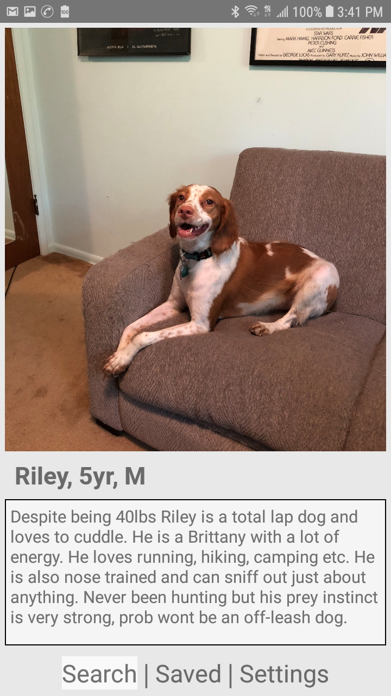
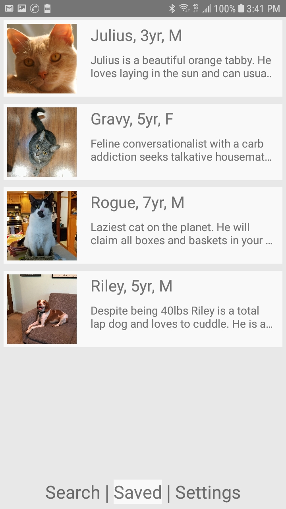
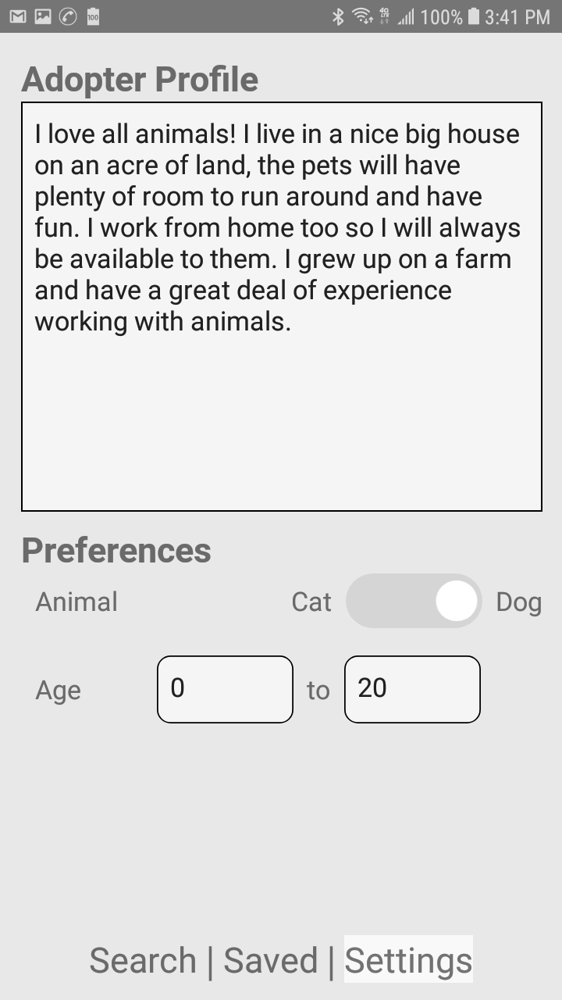
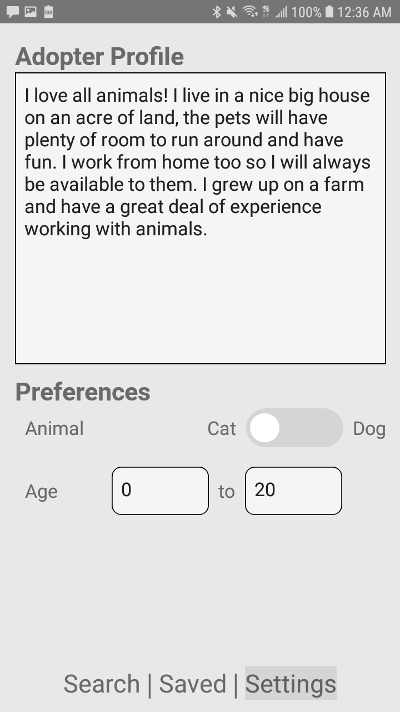
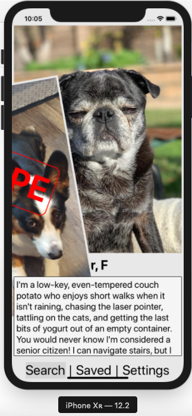
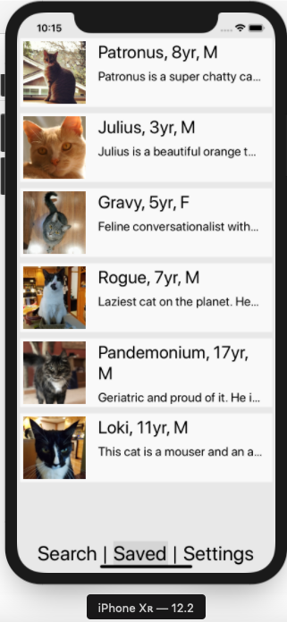
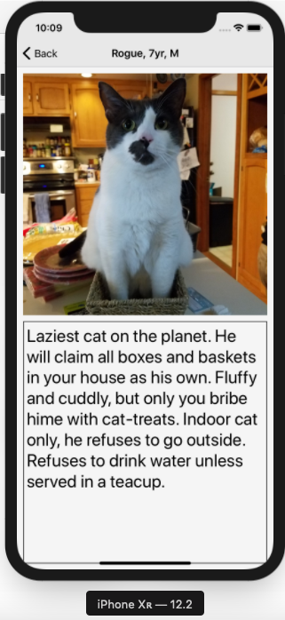
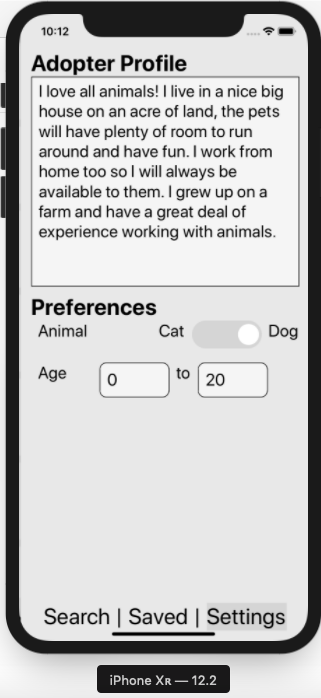

# Pet Adoption ReactNative App

<a href="#SETUP"</a>STEUP</a>

## Preview

### Android
   

### iPhone
   

# SETUP

First of all, before anything, please note that the URIs to `pets.json` and `settings.json` need to be set in:
```
/ API_CONFIG.json
```
