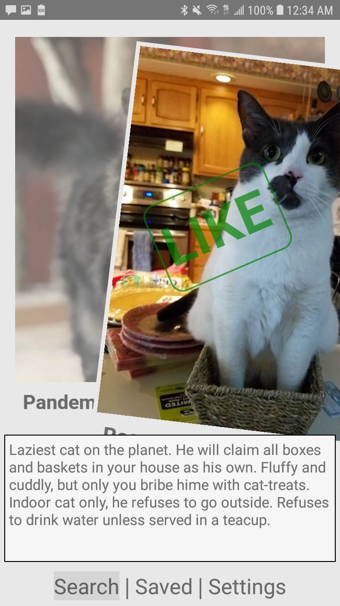
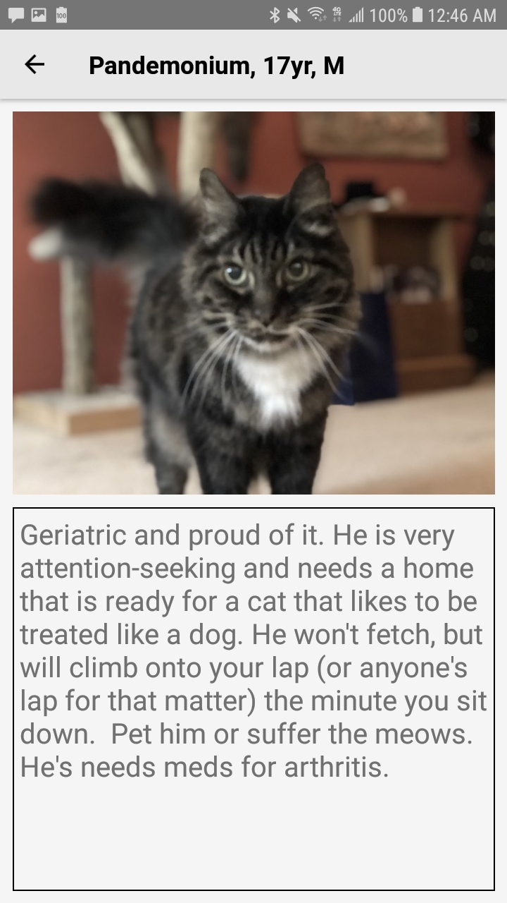

# Pinder - Pet Version of Tinder
A Pet Adoption App -- ReactNative

## Table of Contents
* [Preview](#preview)
  * [Android](#android)
  * [iPhone](#iphone)
* [SETUP](#setup)
  * [Install](#install---installing-all-dependencies)
  * [Config](#config---set-petsjson-and-settingsjson-locations)
  * [Build](#build)
* [Documentation](#documentation)

## Preview

### Android
[Download on Google Play](https://play.google.com/store/apps/details?id=com.github.addyh.pinder)

   

### iPhone
   

# SETUP

## Install - Installing all dependencies
```
git clone https://github.com/addyh/pinder.git
cd pinder
npm install
```

## Config - Set pets.json and settings.json locations
First of all, before anything, please note that the URIs to `pets.json` and `settings.json` are set in:
```
/ API_CONFIG.json
```

## Build

* #### Make sure an Android/iOS device is connected or the emulator is running.

* #### With React-Native-cli:  `npm install -g react-native-cli`
  * #### For Windows / Android dev:  `react-native run-android --variant=release`
  * #### For MacOS / iPhone dev:  `react-native run-ios --configuration Release`

* #### Build With Android Studio
  * #### Start the react native Metro server: `react-native start`
  * #### Then press the green "Run" (play button) to build and run in Android Studio.

* #### Build With XCode
  * #### Open the iOS project `ios/pinder.xcodeproj` with Xcode.
  * #### Then press the green "Run" (play button) to build and run in Xcode.

* #### Build with gradle
  * #### `cd android && ./gradlew assembleRelease`
  * #### `cd android && gradlew.bat assembleRelease` on Windows
  * #### The apk will be saved to `./android/app/build/outputs/apk/app-release.apk`

# Documentation

* **.env** - (build version etc.
* **API_CONFIG.json** - SET API URLS HERE (pets.json and settings.json)
* **index.js** - (main js file
* **/app/**
  * **/actions/**
    * **petsActions.js** - (actions for the petsReducer)
      * exports `fetchPets()` - (get the list of pets for the first time)
        * `fetchImages()` - (go through each pet image)
        * `saveImage()` - (and save it locally, for faster image loading)
      * exports `addSavedPet()` - (user swiped right on a pet)
    * **settingsActions.js** - (actions for the settingsReducer)
      * exports `fetchSettings()` - (get the user settings for the first time)
      * exports `updateProfile()`
      * exports `updateAgeMin()`
      * exports `updateAgeMax()`
      * exports `updateTypePreference()`
    * **types.js**
  * **/components/** - All screens/pages of the app are their own Component
    * **HomeScreen.js** - (a container for all pages and the navigation)
    * **NavBarBottom.js** - (the nav bar at the bottom of all pages)
    * **PetInfoModal.js** - (pet info modal page)
    * **SavedScreen.js** - ("Saved" Page)
    * **SearchScreen.js** - ("Search" Page)
    * **SettingsScreen.js** - ("Settings" Page)
  * **/reducers/**
    * **index.js**
    * **petsReducer.js**
      * FETCH_ALL_PETS (get `state.pets.allPets`)
      * SET_IMG_SRC (create property `state.pets.allPets[n].src` -- a local copy of the image file)
      * ADD_SAVED_PET (add a pet to `state.pets.savedPets`)
    * **settingsReducer.js**
      * FETCH_SETTINGS - (get `state.settings`)
      * UPDATE_PROFILE - (update `state.settings.profile`)
      * UPDATE_AGE_MIN - (update `state.settings.age.min`)
      * UPDATE_AGE_MAX - (update `state.settings.age.max`)
      * UPDATE_TYPE_PREFERENCE - (update `state.settings.typePreference`)
  * **/styles/**
    * **colors.js**
  * **App.js** - (main App file)
  * **store.js** - (Redux store file)
