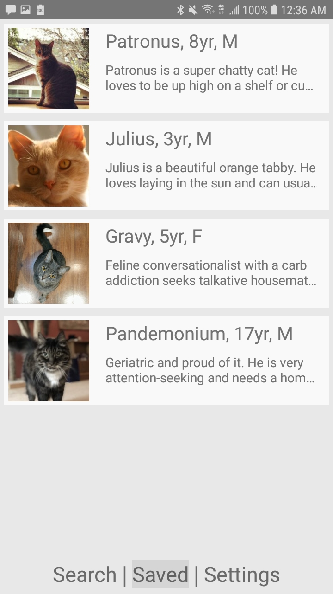

# Pinder - Pet Version of Tinder
A Pet Adoption App -- ReactNative

## Table of Contents
* [Preview](#preview)
  * [Android](#android)
  * [iPhone](#iphone)
* [SETUP](#setup)
  * [Install](#install---installing-all-dependencies)
  * [Config](#config---set-petsjson-and-settingsjson-locations)
  * [Build](#build)
* [Documentation](#documentation)

## Preview

### Android
[Download on Google Play](https://play.google.com/store/apps/details?id=com.github.addyh.pinder)

   

### iPhone
   

# SETUP

## Install - Installing all dependencies
```
git clone https://github.com/addyh/pinder.git
cd pinder
npm install
```

## Config - Set pets.json and settings.json locations
First of all, before anything, please note that the URIs to `pets.json` and `settings.json` are set in:
```
/ API_CONFIG.json
```

## Build

* #### Make sure an Android/iOS device is connected or the emulator is running.

* #### With React-Native-cli:  `npm install -g react-native-cli`
  * #### For Windows / Android dev:  `react-native run-android --variant=release`
  * #### For MacOS / iPhone dev:  `react-native run-ios --configuration Release`

* #### Build With Android Studio
  * #### Start the react native Metro server: `react-native start`
  * #### Then press the green "Run" (play button) to build and run in Android Studio.

* #### Build With XCode
  * #### Open the iOS project `ios/pinder.xcodeproj` with Xcode.
  * #### Then press the green "Run" (play button) to build and run in Xcode.

* #### Build with gradle
  * #### `cd android && ./gradlew assembleRelease`
  * #### `cd android && gradlew.bat assembleRelease` on Windows
  * #### The apk will be saved to `./android/app/build/outputs/apk/app-release.apk`

# Documentation

* **.env**
* **API_CONFIG.json**
* **index.js**
* **/app/**
  * **/actions/**
    * **petsActions.js**
    * **settingsActions.js**
    * **types.js**
  * **/components/**
    * **HomeScreen.js**
    * **NavBarBottom.js**
    * **PetInfoModal.js**
    * **SavedScreen.js**
    * **SearchScreen.js**
    * **SettingsScreen.js**
  * **/reducers/**
    * **index.js**
    * **petsReducer.js**
    * **settingsReducer.js**
  * **/styles/**
    * **colors.js**
  * **App.js**
  * **store.js**
